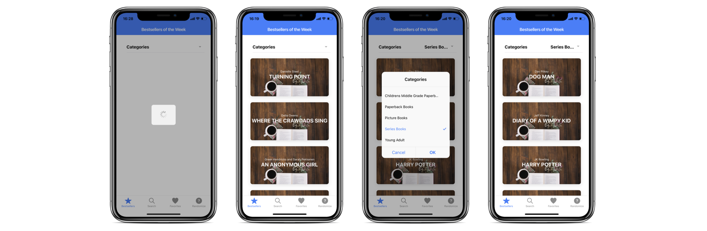
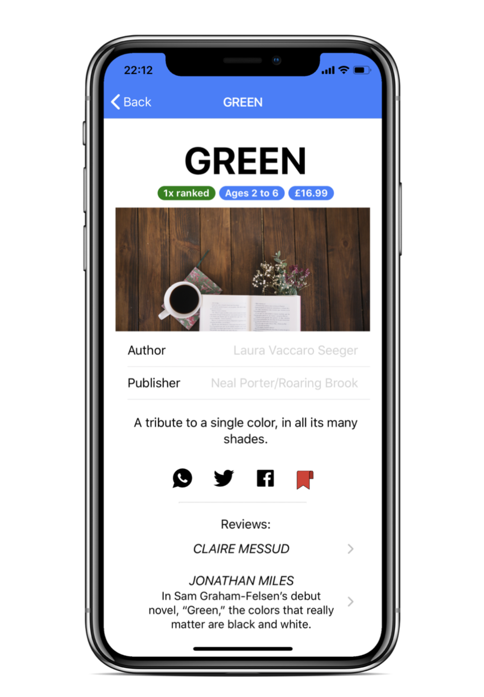

# ukc-web-project
Project app for mobile web module during MSc degree Mobile Application Development at University of Kent Canterbury

    

This project was developed in 12 days for the course "Mobile Web Development" during the Master degree "Mobile Application Development" at the University of Kent in Canterbury. The full project was implemented in **Ionic 4 and Angular**, and its outcome is shown in the document `"report.pdf"`.

The goal of this project was to build a complete mobile web application, which connects to external web services using JavaScript/TypeScript. The developed app should be able to demonstrate the skills learnt in this module.

This project focuses its communication on the New York Times’ Books API (https://developer.nytimes.com/books_api). 

## 📋 The basic requirements for the project were
- Retrieve dynamic data. Your app should allow data to be obtained from the internet using web services, for example using Discogs or MusicBrainz for a mu- sic based mini-project. Although you can select any web services you want, the services should be data rich which will allow you to design a data-driven mo- bile web app with a range of features. A list of available APIs is available on https://www.programmableweb.com/apis/directory
- Functionality. You should consider carefully what functionality you wish to build into the App, but I would suggest you need at least three distinct web pages to be produced, each of which should be data driven.
- User experience. Particular care should be taken in designing a web app which is easy to use, looks attractive and provides a rich user experience. The recommended framework for the development of your app is Ionic 4, however, you are free to use any frameworks you find suitable for mobile development such as Mobile jQuery.
- Additional. Incorporating plugins/technologies/frameworks beyond those presented in the course and/or provision of social media facilities such as Facebook or Twitter will be recognised when the work is assessed.

Additionally, extended requirements were implemented. 
**This project was implemented and tested for an iPhone X.**

## ⭐️ Quick Overview
The result of this project is a fully functioning mobile web application for iPhoneX, that shows information retrieved from the New York Times Bestseller API - therefore showing books. Additionally to exploring new bestseller books, the user can save information into his/her favorites, and search for explicit entries. Furthermore, the user can generate a random selected book from the list if he/she needs some inspiration for a new book to read.

The app consists of 4 tabs

- Bestseller
- Search
- Favorites
- Randomizer

### Bestseller Tab

### Search

### DetailView

## 📐 Report
You can find a detailed description of the project and its outcome in `report.pdf`.